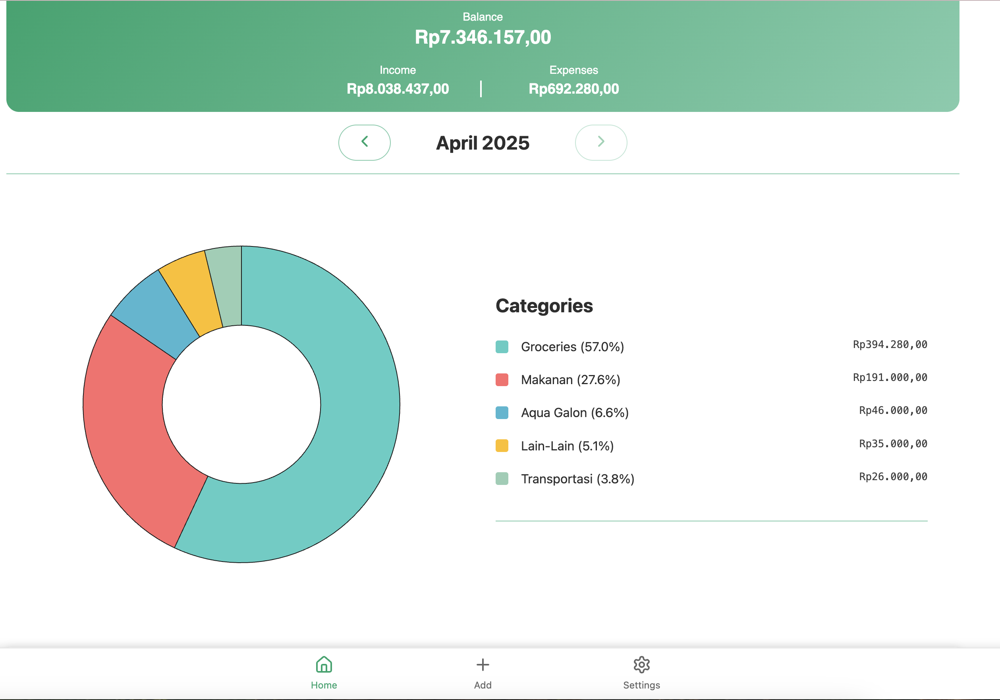
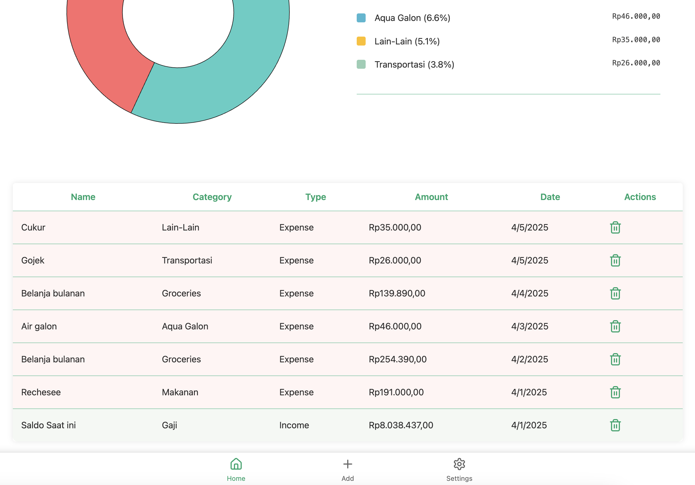
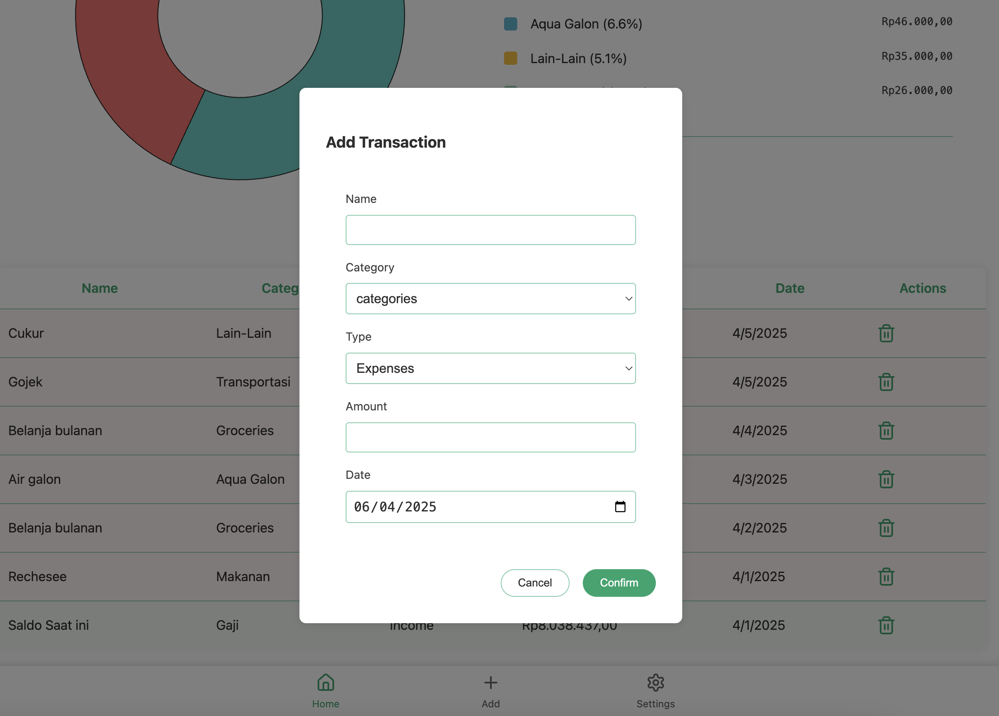

# MoneyFlux

MoneyFlux is an open-source personal expense tracking application that uses Google Sheets as a backend database and a modern Next.js frontend. Track your expenses and income easily with this Progressive Web App.





## Features

- **Google Sheets Backend**: Uses Google Sheets as a database for storing all transactions
- **Progressive Web App**: Loads quickly and works as a standalone app on mobile and desktop
- **PIN Protection**: Secure your financial data with a PIN code
- **Monthly Overview**: View your expenses and income for the current month and previous months
- **Category Management**: Track expenses by categories with visual representations
- **CRUD Operations**: Create, read, update, and delete transactions
- **Data Visualization**: See your spending patterns with charts and summaries
- **Responsive Design**: Works on all devices - desktop, tablet, and mobile

## Architecture

MoneyFlux consists of two main components:

1. **Backend**: 
2. **Frontend**: Next.js application that provides the user interface

## Setup Instructions

### Setting Up the Google Sheets Backend

1. Create a new Google Sheet at [sheets.google.com](https://sheets.google.com)
2. Go to Extensions > Apps Script
3. Replace the default code with the Google Apps Script code from this repository
4. Update the `SHEET_ID` constant with your Google Sheet ID (found in the Sheet URL)
5. Deploy the script as a web app:
   - Click on Deploy > New deployment
   - Select "Web app" as the deployment type
   - Set "Who has access" to "Anyone"
   - Click "Deploy"
   - Copy the web app URL for later use

### Setting Up the Frontend

1. Clone the repository:
   ```bash
   git clone https://github.com/nagacoder/moneyflux.git
   cd moneyflux
   ```

2. Install dependencies:
   ```bash
   npm install
   ```

3. Create a `.env.local` file in the root directory and add your Google Apps Script web app URL:
   ```
   NEXT_PUBLIC_API_ENDPOINT=https://script.google.com/macros/s/.../exec
   ```

4. Run the development server:
   ```bash
   npm run dev
   ```

5. Build for production:
   ```bash
   npm run build
   ```

## Deploying to Cloudflare Pages

The frontend can be easily deployed to Cloudflare Pages or any other hosting provider:

1. Build your application:
   ```bash
   npm run build
   ```

2. Deploy to Cloudflare Pages by connecting your GitHub repository in the Cloudflare Dashboard

## Usage

### Initial Setup

1. Open the app in your browser
2. You'll be prompted to set up a PIN code
3. This PIN code is converted to an API key that will be used for all API requests
4. Once set up, you can start tracking your expenses and income

### Adding Transactions

1. Click the "+" button to add a new transaction
2. Select the transaction type (Income or Expense)
3. Choose or create a category
4. Enter the amount and optional description
5. Submit the form to save the transaction

### Viewing Reports

The dashboard provides several views of your financial data:
- Summary cards showing total income, expenses, and balance
- Pie chart visualizing expenses by category
- Monthly navigation to view historical data
- Transaction list with all details

## API Documentation

The Google Apps Script provides the following API endpoints:

### POST Endpoints

- **createTransaction**: Add a new transaction
- **readTransactions**: Get transactions with optional filters
- **updateTransaction**: Update an existing transaction
- **deleteTransaction**: Remove a transaction
- **getCategories**: Get all available categories
- **addCategory**: Create a new category

### GET Endpoints

- **getCategories**: Retrieve all categories
- **getSummary**: Get summarized transaction data by category
- **readTransactions**: Get transactions with optional query parameters
- **setup**: Initialize the spreadsheet with default sheets and categories

## Security

The API is protected with a simple API key that is derived from the PIN you set. While this provides basic protection, it's recommended to use this application for personal use only and not store extremely sensitive financial information.

## Customization

### Adding New Categories

You can add new categories directly through the application interface or by editing the "Categories" sheet in your Google Spreadsheet.

### Changing the Theme

The application uses a modern, clean design that can be customized through the CSS files in the project.

## Contributing

Contributions are welcome! Please feel free to submit a Pull Request.

1. Fork the repository
2. Create your feature branch (`git checkout -b feature/amazing-feature`)
3. Commit your changes (`git commit -m 'Add some amazing feature'`)
4. Push to the branch (`git push origin feature/amazing-feature`)
5. Open a Pull Request

## License

This project is licensed under the MIT License - see the LICENSE file for details.

## Acknowledgements

- [Next.js](https://nextjs.org/) - The React Framework
- [Google Apps Script](https://developers.google.com/apps-script) - For the backend API
- [React](https://reactjs.org/) - UI Library
- [Recharts](https://recharts.org/) - Charting Library

---

Created by [nagacoder](https://github.com/nagacoder)